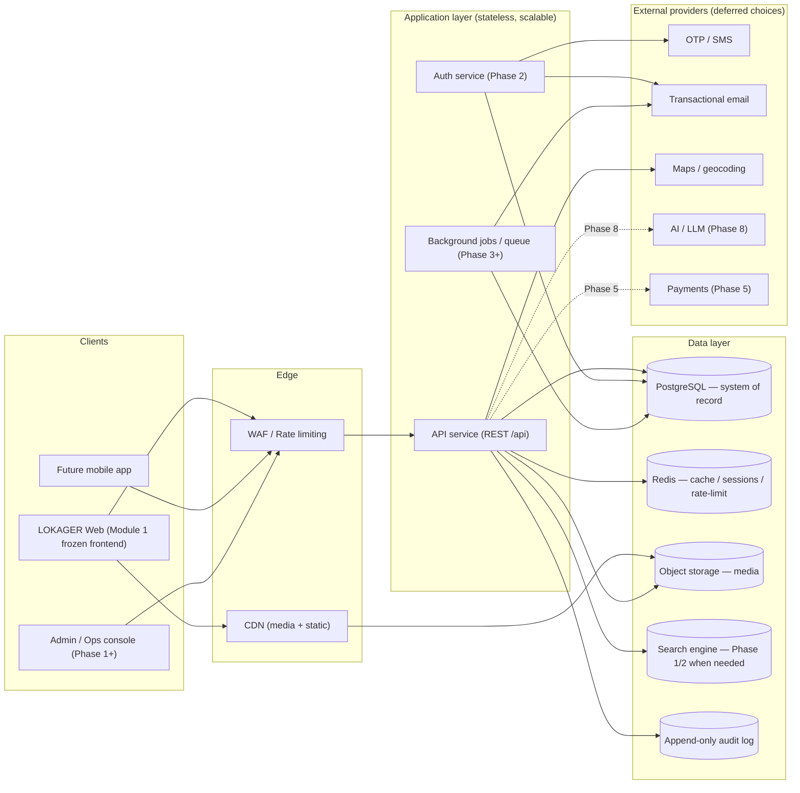

# 02 — System Architecture

> Plain language: This shows the main building blocks of LOKAGER Module 2 and how information flows between them. We deliberately keep the launch simple and add heavier pieces only when needed. No single oversized diagram — each concern is drawn separately here and in later documents.

---

## 2.1 High-level system architecture

**Explanation:** Clients talk to a stateless API behind a WAF/rate-limiter. The API reads/writes PostgreSQL (the source of truth), uses Redis for speed and sessions, stores media in object storage (served by CDN), and writes an audit record for important actions. External providers (OTP, email, maps, payments, AI) are pluggable and chosen later.

**Assumptions:** single primary region in India at launch; horizontal scaling of the stateless API; managed database.
**Decisions pending:** cloud provider, region, framework/language, managed vs self-hosted DB (doc 21).

---

## 2.2 Layered responsibilities

| Layer | Responsibility | MVP? | Notes |
|-------|----------------|------|-------|
| Edge (WAF/CDN) | DDoS/bot protection, static + media delivery | Pre-launch | CDN needed once media volume grows |
| API service | All business logic, validation, authZ enforcement | MVP | Stateless; `/api` prefix (matches current ingress) |
| Auth service | Login, sessions, tokens, recovery | Phase 2 | May be a module of API initially |
| Background jobs | Email sends, image processing, notifications, reports | Phase 3 | Queue-backed; keeps API fast |
| PostgreSQL | System of record (relational integrity + history) | MVP | See doc 07 |
| Redis | Cache, session store, rate-limit counters, job broker | Phase 2/3 | Optional at pure MVP |
| Object storage | Property media, documents | Phase 1 (uploads) | See doc 11 |
| Search engine | Fast/typo-tolerant/geo search | Phase 1/2 when needed | DB filters until then (doc 12) |
| Audit log | Immutable who-did-what | Phase 0 design | See doc 14 |

---

## 2.3 Environments

| Environment | Purpose | Data | Access |
|-------------|---------|------|--------|
| Development | Build & unit test | Synthetic/demo | Engineers |
| Staging | Pre-release verification, migration rehearsal | Anonymised sample | Engineers + founder review |
| Production | Live platform | Real | Least-privilege, audited |

**Principle:** production changes go through staging; database migrations are rehearsed on staging first (see doc 15).

---

## 2.4 Cross-cutting design principles

- **Stateless app tier** → easy horizontal scaling.
- **Modular services / clear boundaries** → replaceable providers, no lock-in.
- **Everything timestamped + attributed** → `created_at`, `updated_at`, `created_by`, status history.
- **Soft-delete + status, not hard delete** for records with legal/audit value.
- **API versioning** (`/api/v1/...`) from the start to allow safe evolution.
- **Config via environment variables**; no secrets in code.
- **Localisation-ready**: currency, language, city/state as first-class fields.

---

## 2.5 What is explicitly NOT in the MVP architecture

Payments, live maps, AI, property-management operations, commercial matchmaking, dedicated search cluster, multi-region replication. These arrive at their phases (doc 19) to avoid premature cost/complexity.

## 2.6 Pending decisions (see doc 21)
Cloud provider, hosting region, backend framework/language, API gateway choice, managed vs self-hosted DB, CDN provider, monitoring/error-tracking provider.
