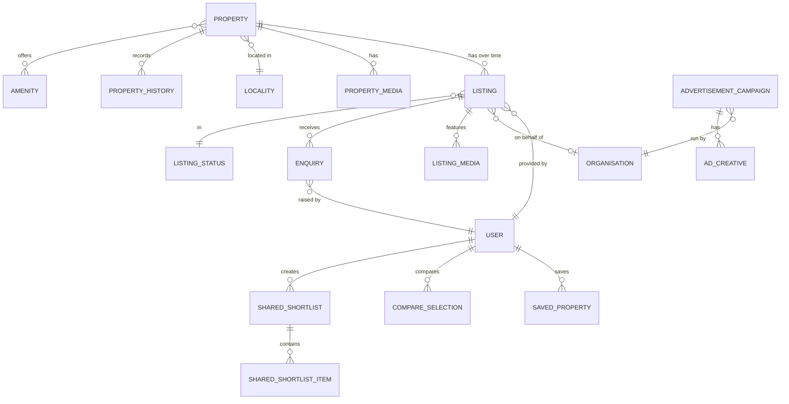

# 03 — Entity-Relationship Model (Core Marketplace)

> Plain language: These are the "things" LOKAGER stores and how they connect. The most important rule is at the top: a **Property** (the real-world asset) is separate from a **Listing** (a temporary advertisement of that property). This document covers the core marketplace only. Manage and Commercial Connect entities are in docs 16 and 17.

---

## 3.1 Core ER diagram

**Explanation:** One `PROPERTY` can have many `LISTING`s across its life (sale, rent, re-list). Media exists at both the property level (persistent) and listing level (marketing). Users save/compare/share properties; enquiries attach to a specific listing; ad campaigns belong to advertiser organisations.

---

## 3.2 Entity definitions

| Entity | Definition | MVP? |
|--------|------------|------|
| Property | The persistent real-world asset (identity, physical facts, location). Never deleted while history matters. | MVP |
| Listing | A time-bound marketing event for a property (sale or rent), by a provider, with price + status. | MVP |
| Property media | Images/videos tied to the property (persistent). | MVP |
| Listing media | Images/videos specific to a listing campaign. | MVP |
| Locality | Neighbourhood/micro-market with context (connectivity, amenities summary). | MVP |
| Amenity | Reusable feature tag (parking, lift, security…). | MVP |
| Listing status | Lifecycle state of a listing (draft→published→…→closed). | MVP |
| Property history | Append-only record of events on a property (price change, status change, media update, listing added). | MVP (design), populate Phase 1 |
| User | Any person account (seeker, owner, broker, developer, vendor, staff…). See doc 05. | Phase 2 |
| Organisation | A company account (brokerage, developer, advertiser, corporate). See doc 05. | Phase 2 |
| Owner | A user (or org) who owns a property; relationship to property. | Phase 2 |
| Broker | A provider user/org listing on behalf of owners. | Phase 2 |
| Developer | A builder org publishing projects/new launches. | Phase 2 |
| Property seeker | A user searching/saving/enquiring. | Phase 2 (anonymous saves in Phase 1) |
| Enquiry / Lead | An expression of interest on a listing; becomes a lead. | Phase 3 |
| Saved property | A user's shortlist entry (localStorage today → account-linked). | Phase 2 |
| Compare selection | Up to 3 properties chosen for side-by-side (transient today). | Phase 2 |
| Shared shortlist | A shareable, expiring collection of properties. | Phase 3 (email), links Phase 1 |
| Advertisement campaign | A sponsored placement with creatives + schedule (matches current `AD_CAMPAIGN`). | Phase 1 schema, Phase 5 ops |
| Ad creative | Desktop/mobile image or video for a campaign. | Phase 1 |

---

## 3.3 Key fields (illustrative — not final schema)

### PROPERTY
| Field | Type | Notes |
|-------|------|-------|
| id | UUID | PK |
| slug | text (unique) | powers `/property/:slug` |
| title | text | display |
| property_type | enum | Apartment, Villa, Plot, Office… |
| bedrooms | int | 0 for land/commercial |
| area_value / area_unit | number / enum | sq.ft, acre |
| locality_id | FK → LOCALITY | |
| geo_lat / geo_lng | decimal | nullable until maps (doc 12) |
| status | enum | active / archived |
| created_at, updated_at, created_by | ts / ts / FK | mandatory |

### LISTING
| Field | Type | Notes |
|-------|------|-------|
| id | UUID | PK |
| property_id | FK → PROPERTY | many listings per property |
| provider_user_id | FK → USER | who listed |
| provider_org_id | FK → ORGANISATION | nullable |
| intent | enum | sale / rent / lease |
| price_value / currency / price_period | number / enum / enum | rent has period |
| status | enum → LISTING_STATUS | see doc 04 |
| published_at / expires_at | ts | freshness |
| freshness_label | derived | "Added 1 day ago" (computed) |
| created_at, updated_at, created_by | mandatory | |

### ENQUIRY
| Field | Type | Notes |
|-------|------|-------|
| id | UUID | PK |
| listing_id | FK | |
| seeker_user_id | FK (nullable) | anonymous enquiry allowed with consent |
| contact_name / phone / email | text | consent-captured (doc 18) |
| message | text | |
| status | enum | new / assigned / contacted / closed |
| consent_id | FK → CONSENT_RECORD | Phase 3 |
| assigned_to | FK → USER (staff) | Phase 3 |

---

## 3.4 Relationships & cardinality

| Relationship | Cardinality | Rule |
|--------------|-------------|------|
| Property → Listing | 1 : many | A property may have 0..n listings over its lifetime |
| Property → Property media | 1 : many | Persistent asset media |
| Listing → Listing media | 1 : many | Campaign-specific media |
| Property → Locality | many : 1 | Each property in exactly one locality |
| Property ↔ Amenity | many : many | Via join table |
| Listing → User (provider) | many : 1 | Every listing has one responsible provider |
| Listing → Enquiry | 1 : many | |
| User → Saved property | 1 : many | Account-linked shortlist |
| Shared shortlist → items | 1 : many | Expiring share |
| Advertisement campaign → Ad creative | 1 : many | Desktop + mobile creatives |

---

## 3.5 Assumptions & pending decisions
- **Assumption:** geo coordinates optional until maps provider chosen (doc 12/21).
- **Assumption:** anonymous users can save (device-scoped) before Phase 2 accounts; saves migrate to account on login.
- **Pending:** exact enum vocabularies for status/type (owner to confirm business terms).
- **Pending:** whether Organisation is mandatory for brokers/developers or optional at MVP.
