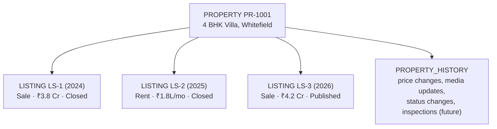
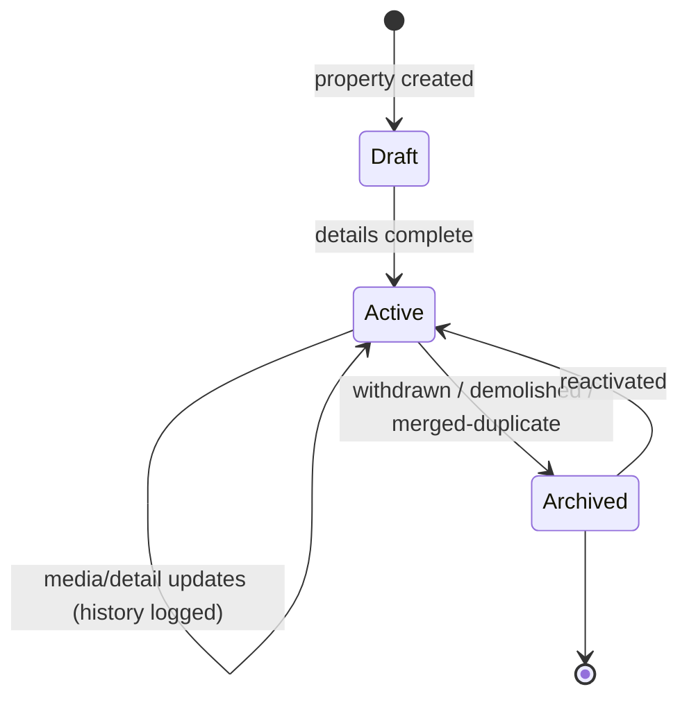
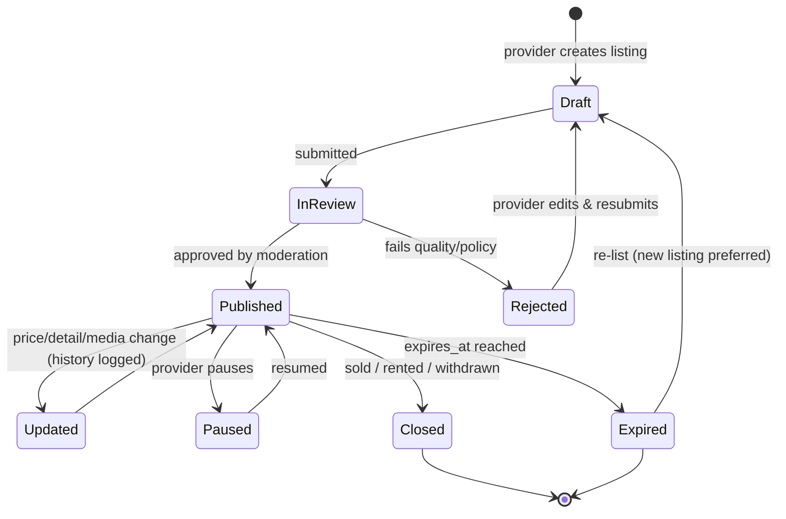

# 04 — PROPERTY vs LISTING Lifecycle

> The single most important design rule in LOKAGER. A **Property** is the real, persistent building/plot. A **Listing** is a temporary advertisement of that property. They must never be merged. This preserves history, prevents duplicates, and is the foundation for price history, freshness, and future intelligence.

---

## 4.1 Why they must stay separate

| If merged (wrong) | With PROPERTY ≠ LISTING (right) |
|-------------------|---------------------------------|
| Re-listing a flat creates a "new" property; history lost | Same property gains a new listing; full history retained |
| Can't show price movement over time | Price history attaches to the property across listings |
| Duplicates multiply (same flat listed by owner + 2 brokers) | Duplicates detected against one property identity |
| "Freshness" is meaningless | Freshness is per-listing; property identity is stable |
| Future analytics/AI unreliable | Clean, connected data for intelligence (Phase 8) |

---

## 4.2 Relationship over time

**Explanation:** One physical property (PR-1001) had a sale listing, later a rental listing, and now a fresh sale listing — each by potentially different providers. All events roll up into the property's history.

---

## 4.3 Property lifecycle

| State | Meaning | Who can set |
|-------|---------|-------------|
| Draft | Being created, not publicly visible | Provider / staff |
| Active | Real asset known to the system (may or may not have a live listing) | Staff / system |
| Archived | No longer tracked live (kept for history) | Staff |

> A property can be **Active with no live listing** — it simply isn't being advertised right now. This is normal and expected.

---

## 4.4 Listing lifecycle

| Status | Meaning | Public? | Notes |
|--------|---------|---------|-------|
| Draft | Being prepared | No | |
| In review | Awaiting moderation (Phase 4) | No | Quality/policy checks |
| Rejected | Failed review | No | With reason |
| Published | Live and visible | Yes | Counts toward freshness |
| Updated | Recently edited (sub-state) | Yes | Logs history |
| Paused | Temporarily hidden by provider | No | |
| Expired | Passed `expires_at` | No | Prompts re-list |
| Closed | Sold/rented/withdrawn | No | Terminal |

> **Rule:** "Verified" is **not** a listing status and must not appear until a real verification process exists (doc 18). Do not conflate "Published" with "Verified".

---

## 4.5 Freshness model

| Concept | Definition |
|---------|------------|
| `published_at` | When the listing went live |
| `last_updated_at` | Last meaningful change (price/media/detail) |
| `expires_at` | When it auto-expires (drives re-list prompts) |
| Freshness label | Computed for display ("Added 1 day ago", "Updated 3 days ago") — never stored as marketing text |

This maps directly to today's frontend `listing.freshness` strings, which become **derived** values from real timestamps.

---

## 4.6 Property history (append-only)

Every meaningful event is recorded, never overwritten:

| Event type | Example |
|------------|---------|
| listing_added | New listing created on property |
| price_changed | ₹3.8 Cr → ₹4.2 Cr |
| status_changed | Listing published → closed |
| media_updated | Photos added/removed |
| inspection_recorded | (Future — Manage) |
| maintenance_recorded | (Future — Manage) |

This is the backbone of future **Price History** and **Property Passport** features shown as "coming soon" in Module 1.

---

## 4.7 Duplicate handling (Phase 4)

When two providers list the same flat, the system links both listings to **one** property (or flags a suspected duplicate for staff review) rather than creating two properties. Detection signals: address/geo proximity, area, project name, unit identifiers.

## 4.8 Assumptions & pending decisions
- **Assumption:** re-listing creates a *new listing* rather than reopening a closed one (cleaner history).
- **Pending:** exact status vocabulary and default `expires_at` window (e.g., 30/60/90 days) — founder/ops decision.
- **Pending:** duplicate-merge policy (auto vs staff-reviewed) — recommend staff-reviewed initially.
