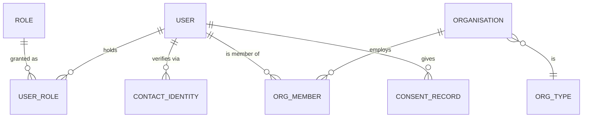

# 05 — User & Organisation Model

> Plain language: Who can have an account, how individuals relate to companies, and what identities exist. This underpins permissions (doc 06) and authentication (doc 10). Accounts arrive in Phase 2; before that, saves/compare work anonymously on the device.

---

## 5.1 People, organisations and roles

**Explanation:** A `USER` is a person. A person may belong to one or more `ORGANISATION`s (a brokerage, developer, corporate, advertiser, vendor company) via `ORG_MEMBER`. Permissions come from `ROLE`s assigned to the user (optionally scoped to an org). Identities (mobile/email) are verified separately; consents are recorded explicitly.

---

## 5.2 Account types

| Type | Individual or Org | Example | Phase |
|------|-------------------|---------|-------|
| Property seeker | Individual | Someone searching to buy/rent | 2 |
| Property owner | Individual (or org) | Owns 1+ properties | 2 |
| Tenant | Individual | Rents a property (Manage) | 6 |
| Broker | Individual + Brokerage org | Lists on behalf of owners | 2 |
| Developer | Org | Builder publishing projects | 2 |
| Vendor | Individual + Vendor org | Service provider (Manage) | 6 |
| Property manager | Individual (staff or partner) | Manages properties (Manage) | 6 |
| Commercial landlord | Individual/org | Owns commercial space | 7 |
| Corporate / brand representative | Individual + Org | Seeks commercial space | 7 |
| Relationship manager | Staff | Handles commercial matches | 7 |
| Operations team | Staff | Moderation, lead handling | 1/3 |
| Finance team | Staff | Billing, payouts (Phase 5+) | 5 |
| Administrator | Staff | Platform admin | 1 |
| Super administrator | Staff | Full control incl. role management | 1 |

---

## 5.3 User entity (illustrative fields)

| Field | Type | Notes |
|-------|------|-------|
| id | UUID | PK |
| display_name | text | |
| primary_mobile | text | India-first; OTP-verifiable |
| primary_email | text | optional at MVP |
| mobile_verified / email_verified | bool | separate from "identity verified" |
| status | enum | active / suspended / deactivated |
| preferred_language | enum | localisation |
| created_at, updated_at, last_login_at | ts | |

> **Important distinction:** `mobile_verified` means "we confirmed they control this number" — it is **not** the same as an identity/document "verified" badge (doc 18). Keep the language separate to avoid over-claiming trust.

---

## 5.4 Organisation entity

| Field | Type | Notes |
|-------|------|-------|
| id | UUID | PK |
| name | text | |
| org_type | enum | brokerage / developer / advertiser / vendor / corporate |
| status | enum | pending / active / suspended |
| onboarding_state | enum | invited / submitted / approved |
| created_at, updated_at, created_by | | |

Org onboarding (broker/developer/vendor) is a **workflow with approval** (Phase 4), not automatic activation.

---

## 5.5 Identity & consent

| Concept | Purpose | Phase |
|---------|---------|-------|
| Contact identity (mobile/email) | Proves control of a contact channel via OTP/link | 2 |
| Identity verification (KYC/docs) | Higher trust; **founder-pending** meaning + process | Future (doc 18) |
| Consent record | Explicit, timestamped consent for contact/marketing/email-shortlist | 3 |

---

## 5.6 Account-linked features (migration from Module 1)

| Module 1 (today) | Module 2 (accounts) |
|------------------|---------------------|
| Saved properties in `localStorage` | Synced to `SAVED_PROPERTY` under the user; device saves migrate on first login |
| Compare (transient, in-memory) | Optionally persisted per user |
| Shared shortlist via `?ids=` URL | Backed by `SHARED_SHORTLIST` with expiry + no PII in URL |

---

## 5.7 Assumptions & pending decisions
- **Assumption:** a person can hold multiple roles (e.g., owner **and** seeker).
- **Assumption:** brokers must be linked to an organisation before publishing (Phase 4) — recommend yes.
- **Pending:** whether identity/document verification is mandatory or optional per role (doc 21).
- **Pending:** whether owners can also self-serve as brokers (policy decision).
