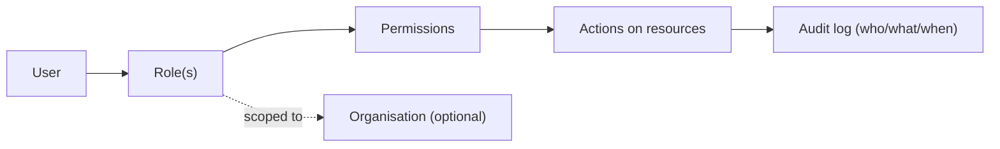

# 06 — Role & Permission Matrix (RBAC)

> Plain language: Who is allowed to do what, and who must approve sensitive actions. LOKAGER uses Role-Based Access Control (RBAC): permissions attach to roles, roles attach to users (optionally scoped to an organisation). This document defines the roles, the permissions, and the approval boundaries.

---

## 6.1 Access model

**Explanation:** A user gets one or more roles; each role carries permissions; some roles are scoped to an organisation (a broker can only edit their org's listings). Every sensitive action is written to the audit log (doc 14).

---

## 6.2 Roles

| Role | Scope | Summary |
|------|-------|---------|
| Guest (anonymous) | none | Browse, search, save on device |
| Seeker | self | Save/compare/share, enquire |
| Owner | own properties | List own property, respond to leads |
| Broker | org | List on behalf of owners |
| Developer | org | Publish projects/new launches |
| Vendor | org | Manage quotations/work orders (Phase 6) |
| Property Manager | assigned properties | Manage vertical operations (Phase 6) |
| Commercial Landlord | own commercial | Give mandates (Phase 7) |
| Corporate/Brand Rep | org | Submit space requirements (Phase 7) |
| Relationship Manager | assigned mandates | Commercial matchmaking (Phase 7) |
| Operations | platform | Moderate listings, handle leads |
| Finance | platform | Billing, invoices, payouts (Phase 5+) |
| Administrator | platform | Configure platform, manage users |
| Super Administrator | platform | Everything incl. role/permission changes |

---

## 6.3 Permission matrix (core marketplace)

Legend: ✅ allowed · ⚠️ allowed with approval/limit · 🔍 own/assigned only · ❌ not allowed

| Capability | Guest | Seeker | Owner | Broker | Developer | Ops | Admin | SuperAdmin |
|------------|:-----:|:------:|:-----:|:------:|:---------:|:---:|:-----:|:----------:|
| Browse & search | ✅ | ✅ | ✅ | ✅ | ✅ | ✅ | ✅ | ✅ |
| Save/compare (device) | ✅ | ✅ | ✅ | ✅ | ✅ | ✅ | ✅ | ✅ |
| Save (account-linked) | ❌ | ✅ | ✅ | ✅ | ✅ | ✅ | ✅ | ✅ |
| Create shared shortlist | ✅* | ✅ | ✅ | ✅ | ✅ | ✅ | ✅ | ✅ |
| Submit enquiry | ✅** | ✅ | ✅ | ✅ | ✅ | ✅ | ✅ | ✅ |
| Create listing (draft) | ❌ | ❌ | 🔍 | 🔍 | 🔍 | ✅ | ✅ | ✅ |
| Submit listing for review | ❌ | ❌ | 🔍 | 🔍 | 🔍 | ✅ | ✅ | ✅ |
| Approve/reject listing | ❌ | ❌ | ❌ | ❌ | ❌ | ✅ | ✅ | ✅ |
| Edit any listing | ❌ | ❌ | 🔍 | 🔍 | 🔍 | ✅ | ✅ | ✅ |
| View/handle leads | ❌ | 🔍 | 🔍 | 🔍 | 🔍 | ✅ | ✅ | ✅ |
| Assign leads | ❌ | ❌ | ❌ | ❌ | ❌ | ✅ | ✅ | ✅ |
| Manage ad campaigns | ❌ | ❌ | ❌ | ❌ | ⚠️ | ⚠️ | ✅ | ✅ |
| Manage users/roles | ❌ | ❌ | ❌ | ❌ | ❌ | ❌ | ⚠️ | ✅ |
| Change platform config | ❌ | ❌ | ❌ | ❌ | ❌ | ❌ | ⚠️ | ✅ |
| View audit logs | ❌ | ❌ | ❌ | ❌ | ❌ | 🔍 | ✅ | ✅ |

\* Guest shared shortlist allowed but without email delivery (email requires consent + account/verified email — doc 18).
\** Anonymous enquiry allowed only with explicit consent capture.

---

## 6.4 Approval authority (boundaries)

| Action | Requestor | Approver | Notes |
|--------|-----------|----------|-------|
| Publish a listing | Owner/Broker/Developer | Operations | Phase 4 moderation |
| Onboard broker/developer/vendor org | Applicant | Operations/Admin | Phase 4 |
| Refund / credit | Finance | Admin | Phase 5+ |
| Repair spend above limit (Manage) | Property Manager | Owner | Phase 6 — see doc 16 |
| Commission disclosure change | RM | Admin | Phase 7 |
| Role assignment (staff) | Admin | Super Admin | Sensitive |
| Delete/anonymise personal data | Ops | Admin + legal | Privacy request (doc 18) |

---

## 6.5 Principles

- **Least privilege**: users get the minimum permissions for their job.
- **Separation of duties**: the person who creates a listing is not the one who approves it.
- **Scoped access**: org roles can only touch their org's data.
- **Everything sensitive is audited** (doc 14).
- **Break-glass**: Super Admin actions are heavily audited and rare.

## 6.6 Assumptions & pending decisions
- **Assumption:** Operations handles both moderation and leads at launch (small team); split later.
- **Pending:** repair-approval monetary limits (doc 16/21) — founder to set default (e.g., ₹X without owner approval).
- **Pending:** whether developers can self-manage ad campaigns or only via Ops (Phase 5).
