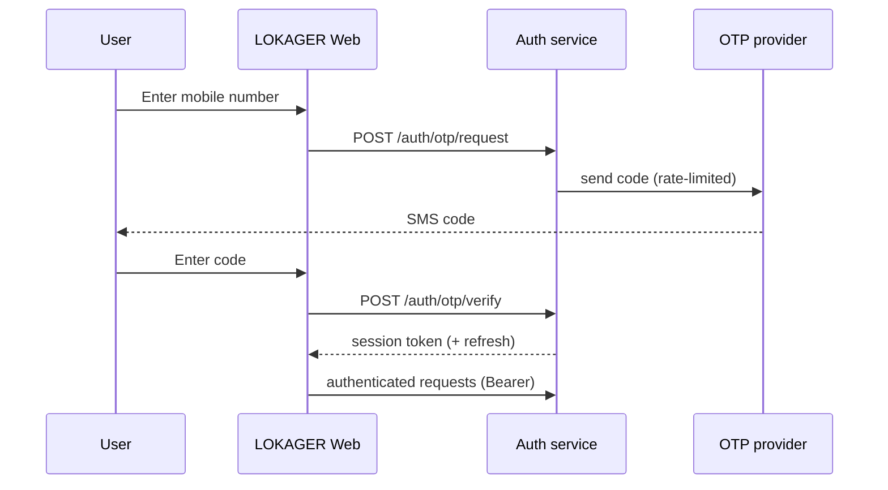

# 10 — Authentication Options

> Plain language: How people prove who they are when logging in. India-first means mobile-number login is king. This document compares options and gives a recommendation. It also separates "logged in" from "identity verified" — two very different things.
>
> ✅ **FOUNDER-APPROVED (June 2026, D3):** Mobile OTP is the **primary** customer auth method; email OTP/link secondary; **mandatory stronger 2FA for employees/administrators**; rate limiting, OTP attempt limits, session/device monitoring, account-recovery, and **SIM-swap / account-takeover protection**; social login optional future. **OTP and auth providers remain founder-decision-pending.** Approval covers Phase 0 design only — **no auth will be built or activated** until the Phase 0 design and a provider are approved.

---

## 10.1 Authentication flow (recommended shape)

**Explanation:** Passwordless mobile OTP for the mainstream Indian audience; the same pattern works for email OTP/magic link. Tokens are short-lived with refresh; every auth event is audited.

---

## 10.2 Options compared

| Method | Fit for LOKAGER | Pros | Cons | Recommendation |
|--------|-----------------|------|------|----------------|
| **Mobile OTP (SMS)** | High (India-first) | Familiar, no password, high completion | Per-SMS cost, deliverability, OTP abuse risk | **Primary at launch** |
| Email OTP / magic link | Medium-high | Cheap, good for NRIs/corporates | Email deliverability, phishing perception | **Secondary** (esp. Commercial/NRI) |
| Google / Apple social login | Medium | Fast, trusted, no OTP cost | Adds provider dependency; less universal in India | **Optional add-on** |
| Password | Low-medium | Offline, familiar to some | Breach risk, reset burden, weak passwords | **Not recommended as primary**; optional for staff |
| WhatsApp OTP | Medium (future) | High open rates in India | Business API cost/approval | **Evaluate later** |

---

## 10.3 Recommendation

1. **Launch: Mobile OTP as primary**, email OTP/magic link as secondary.
2. **Social login (Google/Apple): optional**, add if data shows friction — especially useful for corporate/NRI users in Commercial Connect.
3. **Passwords: avoid for consumers.** For staff/admin, use strong password **plus** a second factor (or SSO) given elevated privileges.
4. **Never conflate "authenticated" with "verified".** Controlling a phone/email ≠ verified identity/documents (doc 18).

---

## 10.4 Session & token management

| Concern | Recommendation |
|---------|----------------|
| Token type | Short-lived access token + refresh token |
| Storage (web) | HttpOnly, Secure cookies preferred; or memory + refresh |
| Session store | Redis (revocation, device list) |
| Expiry | Access ~15–60 min; refresh days, revocable |
| Multi-device | Allowed; visible session list; revoke individual sessions |
| Logout everywhere | Supported (invalidate refresh tokens) |

---

## 10.5 Account recovery

| Scenario | Approach |
|----------|----------|
| Lost phone number | Fallback to verified email OTP; else manual support with checks |
| Both channels lost | Support-assisted recovery with identity checks (audited) |
| Suspicious activity | Force re-verify + notify user |

---

## 10.6 Role verification & provider onboarding

- Being a **broker/developer/vendor** is not self-granted: it requires an onboarding workflow with Operations approval (Phase 4, doc 06).
- **Admin access** requires the strongest controls: 2FA/SSO, IP/session monitoring, heavy audit, least privilege, Super Admin approval for role grants.

---

## 10.7 Abuse prevention

| Threat | Control |
|--------|---------|
| OTP flooding | Per-number + per-IP rate limits, cooldowns, exponential backoff |
| OTP guessing | Attempt limits, short code TTL, lockout |
| SMS pumping / toll fraud | Provider allow-lists, velocity checks, monitoring |
| Credential stuffing (staff pw) | 2FA, breach-password checks |

---

## 10.8 MVP vs pre-launch vs future
| Tier | Auth posture |
|------|--------------|
| MVP (Phase 2) | Mobile OTP + email OTP; Redis sessions; rate limiting |
| Pre-launch | Staff 2FA/SSO; account recovery flows; device/session management |
| Future | Social login, WhatsApp OTP, optional identity verification per role |

## 10.9 Founder decisions pending (doc 21)
- OTP/SMS provider; email provider (deferred, cost-impacting).
- Whether social login is enabled at launch.
- Whether identity verification is mandatory for providers before publishing.

> **Integration note:** When approved, authentication will be implemented via the platform's integration playbook (JWT-based custom auth or Emergent-managed Google auth), not hand-rolled. No auth code is written during planning.
