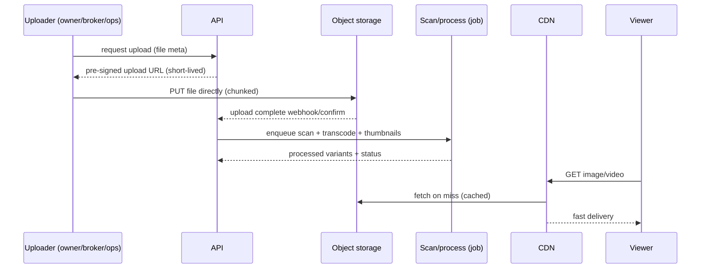

# 11 — Media Storage Architecture

> Plain language: Where property photos, videos, ad creatives and documents live. Rule: media never goes inside the database — it lives in cloud **object storage** and is delivered fast via a **CDN**. Uploads are safe, moderated, and access-controlled. No storage provider is chosen or provisioned yet.

---

## 11.1 Upload & delivery flow

**Explanation:** Clients upload **directly** to object storage using short-lived pre-signed URLs (bypasses proxy size limits and keeps the API light). A background job scans, transcodes video, and generates image thumbnails. Viewers get media through the CDN.

---

## 11.2 Media types & handling

| Media | Where | Processing | Access |
|-------|-------|-----------|--------|
| Property/listing images | Object storage | Resize variants (thumb/card/hero), strip EXIF/GPS | Public (published) / private (draft) |
| Property/listing videos | Object storage | Transcode, poster frame, size caps | Public/private |
| Ad creatives (desktop/mobile) | Object storage | Validate dimensions/format | Public when campaign active |
| Legal/KYC documents (future) | Object storage (private) | Encrypted, restricted, no CDN | Strictly private, audited |
| Inspection photos/videos (Manage, future) | Object storage (private) | Timestamped, tamper-evident metadata | Owner/manager only |

---

## 11.3 Key design rules

- **Direct-to-storage, chunked uploads** via pre-signed URLs (handles large files, avoids proxy limits).
- **Pre-signed URLs are short-lived** and scoped to one object.
- **Server-side validation**: content-type, size caps, image/video sniffing, malware scan.
- **Strip location EXIF** from public images (privacy) unless intentionally geotagged.
- **Public vs private buckets/prefixes**: drafts and documents are private; published marketing media is public via CDN.
- **Immutable object keys** (content-addressed or UUID) → safe CDN caching + versioning.
- **Never store binaries in PostgreSQL** — DB holds only metadata + object keys.

---

## 11.4 Media metadata (in PostgreSQL)

| Field | Notes |
|-------|-------|
| id, property_id / listing_id / campaign_id | ownership |
| object_key | storage pointer |
| kind | image / video / document |
| variants | thumbnail/card/hero/poster keys |
| status | pending / clean / rejected |
| uploaded_by, created_at | attribution |
| is_public | visibility gate |
| moderation_state | Phase 4 |

---

## 11.5 Moderation (Phase 4)

Media attached to draft listings is **private** until the listing is approved. Moderators can reject individual media. Rejected media is retained (audit) but never public.

---

## 11.6 Cost & performance

| Lever | Approach |
|-------|----------|
| Storage cost | Lifecycle rules (move rarely-accessed to cheaper tiers), delete orphaned uploads |
| Bandwidth cost | CDN caching, right-sized image variants, modern formats (WebP/AVIF) |
| Video cost | Transcode to efficient codecs, cap resolution/length, lazy-load |
| Speed | CDN edge delivery, responsive `srcset`, poster frames |

---

## 11.7 MVP vs pre-launch vs future
| Tier | Media posture |
|------|---------------|
| MVP | Object storage + pre-signed uploads + basic image variants |
| Pre-launch | CDN, malware scan, video transcode, moderation, EXIF strip |
| Future | Private encrypted docs (KYC/inspections), tamper-evident evidence, DRM if needed |

## 11.8 Pending decisions (doc 21)
Object-storage provider, CDN provider, video transcoding approach, malware-scan provider, retention for rejected/orphaned media. **Recommendation:** use the platform's object-storage integration playbook when approved; do not store media as Base64 in the database.
