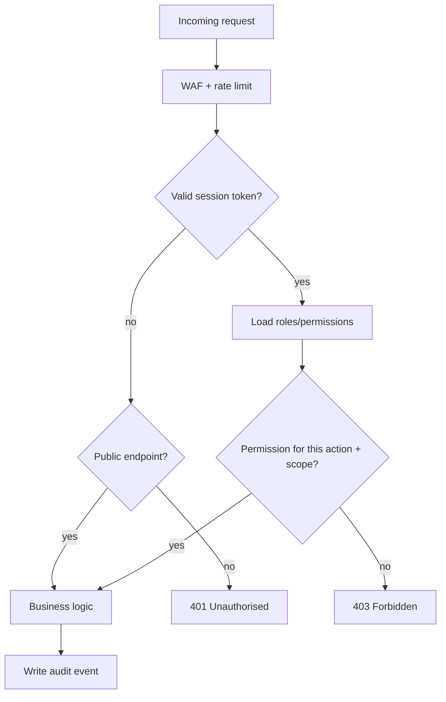

# 13 — Security Architecture

> Plain language: How LOKAGER protects accounts, personal data, money records and the platform itself. Security is designed from Phase 0 — not bolted on later. This covers who-can-do-what (authorisation), protecting data in transit and at rest, and defending against common attacks. No security tooling is provisioned yet.

---

## 13.1 Authentication & authorisation flow

**Explanation:** Every request passes edge protection, then authentication (who are you), then authorisation (are you allowed, and only on your own/assigned data). Sensitive actions are audited.

---

## 13.2 Security domains

| Domain | Controls | Phase |
|--------|----------|-------|
| Authentication | OTP, short-lived tokens, session revocation, staff 2FA (doc 10) | 2 |
| Authorisation | RBAC, least privilege, org-scoping, separation of duties (doc 06) | 2 |
| Transport | TLS everywhere (HTTPS), HSTS | 0 |
| Data at rest | Encrypted DB + storage; encrypted private documents | 0 |
| Secrets | Env vars / secret manager; never in code or logs | 0 |
| Input validation | Strict validation at all boundaries; parameterised queries | 0/1 |
| Rate limiting / abuse | Per-IP/user/endpoint limits, OTP/enquiry throttling | 2/3 |
| PII protection | Minimise, mask, restrict; contact masking option | 2/3 |
| Media safety | Malware scan, EXIF strip, private drafts (doc 11) | 4 |
| Payments | PCI-conscious: never store card data; use gateway tokens (Phase 5) | 5 |
| Monitoring | Error tracking, anomaly alerts, audit review | 1+ |

---

## 13.3 Data protection & privacy

| Principle | Application |
|-----------|-------------|
| Data minimisation | Collect only what's needed; anonymous browse/save by default |
| Purpose limitation | Consent recorded per purpose (contact, marketing, email-shortlist) |
| PII masking | Owner contact can be masked/routed (founder decision, doc 21) |
| No PII in URLs | Shared shortlists use opaque tokens, not emails/IDs |
| Encryption | TLS in transit; encryption at rest for DB, storage, backups |
| Right to erasure | Privacy-request workflow (delete/anonymise, audited) — doc 18 |
| Data residency | India region recommended (doc 21) |

---

## 13.4 Threat model (top risks)

| Threat | Mitigation |
|--------|-----------|
| Account takeover | OTP rate limits, session revocation, anomaly alerts, staff 2FA |
| Data scraping / lead theft | Rate limits, contact masking, bot detection, pagination caps |
| Listing fraud / spam | Moderation (Phase 4), duplicate detection, provider onboarding |
| SQL injection | Parameterised queries/ORM, input validation |
| XSS/CSRF | Output encoding, CSP, CSRF tokens/SameSite cookies |
| SMS/OTP toll fraud | Provider controls, velocity limits, geo/number allow-lists |
| Privilege escalation | Strict RBAC checks server-side, org-scoping, audit |
| Media abuse (malware/illegal) | Scan, moderation, private drafts, reporting |
| Secret leakage | Secret manager, no secrets in logs, rotation |

---

## 13.5 Secure development practices

- Server-side authorisation on **every** endpoint (never trust the client).
- Dependency scanning + timely patching.
- Staging mirrors production; migrations rehearsed (doc 15).
- Principle of least privilege for infra and DB accounts.
- Security review gate before commercial launch.

---

## 13.6 MVP vs pre-launch vs future
| Tier | Security posture |
|------|------------------|
| MVP | TLS, RBAC, input validation, secrets management, basic rate limits, audit design |
| Pre-launch | Full rate limiting, monitoring/alerting, staff 2FA, media scanning, privacy-request workflow, security review |
| Future | Advanced fraud detection, anomaly ML, bug-bounty, formal pen-tests, SOC/compliance certifications if pursued |

## 13.7 Pending decisions (doc 21)
Monitoring/error-tracking provider; WAF/bot-protection provider; whether owner contact is masked; data-residency region; formal pen-test/audit before commercial launch.
