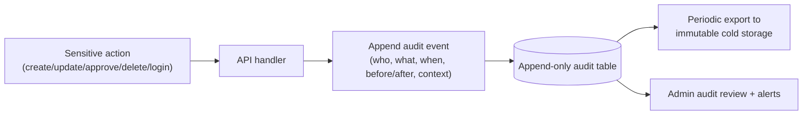

# 14 — Audit-Log Plan

> Plain language: A permanent, tamper-evident record of "who did what, when" across LOKAGER. Because the platform will hold agreements, approvals, money and personal data, an audit trail is essential for trust, dispute resolution, compliance and debugging. Designed in Phase 0.

---

## 14.1 Audit event flow

**Explanation:** Whenever something important happens, the system appends an immutable record capturing the actor, action, target, timestamp, and what changed. Records are never edited or deleted; they are periodically exported to write-once storage.

---

## 14.2 What gets audited

| Category | Examples |
|----------|----------|
| Authentication | Login, logout, OTP request/verify, failed attempts, session revoke |
| Authorisation | Permission-denied events, role/permission changes |
| Listings | Create, edit, submit, approve, reject, publish, close, price change |
| Properties | Create, status change, media add/remove, duplicate merge |
| Leads/enquiries | Create, assign, status change, consent capture |
| Users/orgs | Create, role grant/revoke, suspend, onboarding approval |
| Money (Phase 5+) | Invoice, payment, refund, payout, expense, repair approval |
| Manage (Phase 6) | Mandate, inspection, ticket, approval, work order, report |
| Data privacy | Erasure/anonymisation, data export requests |
| Admin/config | Platform config changes, feature flags |

---

## 14.3 Audit record fields

| Field | Purpose |
|-------|---------|
| id | Unique event id |
| occurred_at | UTC timestamp |
| actor_user_id | Who did it (or "system") |
| actor_role / actor_org | Context of authority |
| action | Verb (e.g., `listing.approved`) |
| target_type / target_id | What was affected |
| before / after (diff) | Change snapshot (redacted for secrets) |
| ip / user_agent | Request context |
| request_id | Correlate with app logs |
| result | success / denied / error |

---

## 14.4 Integrity & tamper-evidence

| Control | Approach |
|---------|----------|
| Append-only | No UPDATE/DELETE on audit table; DB permissions enforce this |
| Immutability | Periodic export to write-once (WORM) / versioned cold storage |
| Chaining (optional, high-value) | Hash-chain records so tampering is detectable |
| Separation | Audit store access separated from app write paths |
| Redaction | Never log secrets/passwords/OTPs/full card data |

---

## 14.5 Retention & access

| Aspect | Recommendation | Pending |
|--------|----------------|---------|
| Retention period | Keep security/financial/agreement audit for a legally-appropriate multi-year period | Exact durations = legal decision (doc 18/21) |
| Access | Admin/Super Admin (full), Ops (scoped) — all audit reads themselves audited | — |
| Export | Scheduled export to immutable storage; restorable for investigations | — |
| Privacy | Audit may contain PII → protected + access-controlled | — |

---

## 14.6 Relationship to Property History

Property history (doc 04) is a **business-facing** timeline (price changes, listings, media) shown in product features. The audit log is a **security/compliance** record of all sensitive actions. They overlap but serve different audiences; both are append-only.

## 14.7 MVP vs pre-launch vs future
| Tier | Audit posture |
|------|---------------|
| MVP | Append-only audit table for auth + listing/property changes |
| Pre-launch | Full coverage incl. leads/consents/admin; export to immutable storage; admin review + alerts |
| Future | Hash-chaining, anomaly detection, compliance reporting/export |

## 14.8 Pending decisions (doc 21)
Retention durations (legal); whether hash-chaining is required; immutable cold-storage provider.
