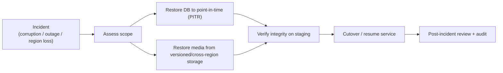

# 15 — Backup & Disaster Recovery Plan

> Plain language: How LOKAGER survives accidents, corruption, or an outage without losing data. Two numbers matter: **RPO** (how much recent data we can afford to lose) and **RTO** (how fast we must be back up). Designed in Phase 0; scaled before commercial launch.

---

## 15.1 What must be recoverable

| Asset | Source of truth | Backup approach |
|-------|-----------------|-----------------|
| PostgreSQL (all records) | Managed PostgreSQL | Automated daily backups + continuous WAL (Point-In-Time Recovery) |
| Object storage (media/docs) | Object storage | Versioning + lifecycle + cross-region copy |
| Audit log | Append-only tables | Included in DB backup + immutable export (doc 14) |
| Secrets/config | Secret manager | Managed backup + documented recovery |
| Infrastructure definition | Infrastructure-as-code (recommended) | Version-controlled, reproducible |

---

## 15.2 Recovery objectives (targets)

| Tier | RPO (max data loss) | RTO (max downtime) | Notes |
|------|---------------------|--------------------|-------|
| MVP | ≤ 24 h (daily backup) → improve with WAL | Hours | Acceptable pre-revenue |
| Before commercial launch | ≤ 5–15 min (PITR/WAL) | ≤ 1–2 h | Money + agreements live |
| Future scale | Near-zero (replicas/failover) | Minutes | HA / multi-AZ |

> Exact RPO/RTO commitments become part of any customer SLA and are a founder/ops decision (doc 21).

---

## 15.3 DR flow

---

## 15.4 Practices

| Practice | Why |
|----------|-----|
| Automated backups | No reliance on manual steps |
| Point-In-Time Recovery (WAL) | Recover to the moment before an error |
| Cross-region backup copies | Survive a regional failure |
| **Restore drills** (rehearsals) | A backup you've never restored is a hope, not a plan |
| Migration rehearsal on staging | De-risk schema changes before production |
| Immutable audit export | Compliance + tamper resistance |
| Object versioning | Recover overwritten/deleted media |
| Documented runbooks | Anyone on-call can execute recovery |

---

## 15.5 Backup security

- Backups are **encrypted** at rest and in transit.
- Backup access is least-privilege and **audited**.
- Backups may contain PII → same protection as production data.
- Test restores use anonymised data where possible.

## 15.6 MVP vs pre-launch vs future
| Tier | DR posture |
|------|------------|
| MVP | Managed daily backups; documented manual restore; one rehearsal |
| Pre-launch | PITR/WAL, cross-region copies, scheduled restore drills, runbooks, monitoring/alerts |
| Future | Standby replica + automated failover, multi-AZ/region, tighter RPO/RTO |

## 15.7 Pending decisions (doc 21)
Cloud/region strategy; final RPO/RTO commitments (SLA); managed-DB provider; how often restore drills run.
