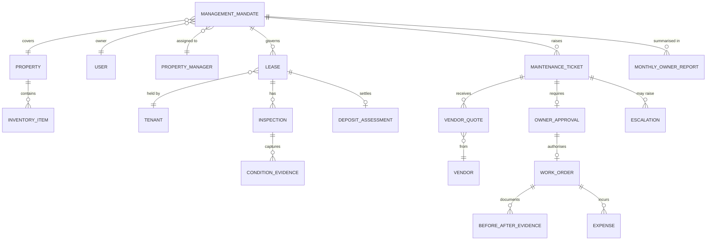
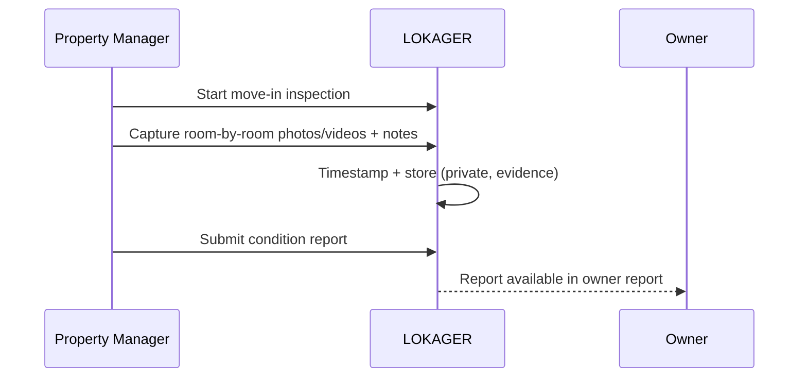
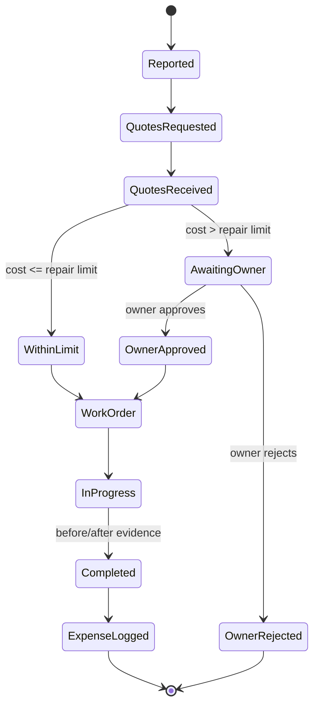

# 16 — LOKAGER Manage Architecture (Future Vertical — Phase 6)

> Plain language: LOKAGER Manage is a **residential property management** service for owners who can't manage their own property — outstation/NRI owners, investors, and owners of tenanted or vacant homes. This document plans its data models and workflows. **Nothing here is built during Module 2 planning, and it cannot launch commercially until legal/operational review is complete (doc 18).** No public pages or dashboards are built yet.

---

## 16.1 Scope & audience

| Serves | Examples |
|--------|----------|
| Owners who can't self-manage | Outstation owners, NRI owners, investors, multi-property owners |
| Property situations | Tenanted properties, vacant properties |

Manage is **separate** from LOKAGER Services (painting/interiors/repairs as standalone jobs) — Manage is an ongoing management relationship that *may use* vendors.

---

## 16.2 Entity model

---

## 16.3 Entity definitions

| Entity | Definition |
|--------|------------|
| Management mandate | Owner's authorisation for LOKAGER to manage a property (scope, term, limits) |
| Owner authorisation | Signed permission + repair-approval limit + payout details |
| Property manager | Person responsible for the mandate's day-to-day |
| Tenant | Occupant under a lease |
| Lease | Rental agreement terms (rent, period, deposit) |
| Inspection | Move-in/move-out or periodic condition check |
| Condition evidence | Photos/videos with timestamps (private, tamper-evident) |
| Property inventory | Fixtures/fittings/appliances list |
| Maintenance ticket | A reported issue needing work |
| Vendor quote | A vendor's price for a ticket |
| Owner approval | Owner's go-ahead (auto if within limit, else explicit) |
| Work order | Authorised job assigned to a vendor |
| Before/after evidence | Proof of completed work |
| Expense | Cost incurred (linked to owner report) |
| Monthly owner report | Statement of activity, spend, rent, issues |
| Repair-approval limit | ₹ threshold below which manager may proceed without owner sign-off |
| Deposit assessment | Move-out deductions vs security deposit |
| Escalation history | Record of escalations and resolutions |

---

## 16.4 Core workflows

### Inspection & condition report

### Maintenance ticket & owner approval (money control)

**Explanation:** The repair-approval limit is the key financial control — small repairs proceed quickly; anything above the owner-set threshold needs explicit owner approval. Every step is audited (doc 14).

---

## 16.5 The 12-point phase spec (Phase 6)

| # | Item | Detail |
|---|------|--------|
| 1 | Scope | Residential management pilot: mandates, leases, inspections, tickets, vendor quotes, approvals, work orders, expenses, owner reports |
| 2 | Dependencies | Phase 0–4 (properties, media, users/roles, providers), payments design (Phase 5) if handling money |
| 3 | Data models | Entities in 16.3 |
| 4 | APIs | `/manage/*` (doc 08) |
| 5 | Admin tools | Manager assignment, ticket oversight, report generation, escalation handling |
| 6 | Security controls | Private evidence, strict scoping (manager sees only assigned), owner approval gates, full audit |
| 7 | Legal gates | Property-management agreement, owner mandate, tenant consent, vendor agreements, fund-handling permissions (doc 18) |
| 8 | Operational | Vetted vendors + property managers in pilot city; SLA definitions |
| 9 | Acceptance criteria | Owner can grant mandate, view inspections, approve repairs, receive monthly report; evidence stored; audit complete |
| 10 | Founder approvals | Repair-approval default limit, fund-handling policy, pilot city, fee model |
| 11 | Complexity | High (operational + financial + legal) |
| 12 | Exit conditions to next phase | Successful controlled pilot, legal sign-off, clean audit, positive owner outcomes |

---

## 16.6 Critical founder decisions (doc 21)
- **Does LOKAGER hold/route rent or vendor funds?** (Strongly recommend NOT initially — triggers payment-aggregator/escrow obligations.)
- Default repair-approval limit.
- Pilot location (Bengaluru/Mysuru per founder).
- Property-management fee model.

> Manage begins as a **controlled Bengaluru/Mysuru pilot** before any wider rollout. No public Manage pages/dashboards during Module 2 planning.
