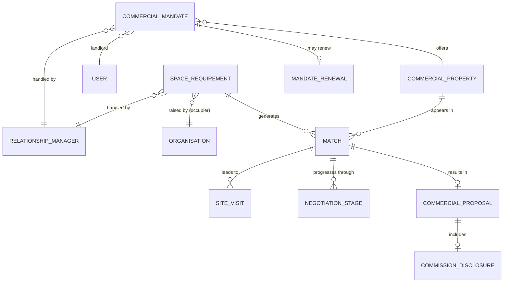
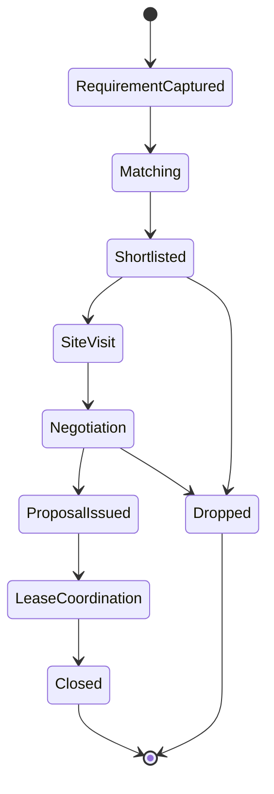

# 17 — LOKAGER Commercial Connect Architecture (Future Vertical — Phase 7)

> Plain language: Commercial Connect matches **commercial-space owners** with **corporate/brand occupiers** (retail brands, QSR chains, offices, IT companies, banks, co-working, warehouses, logistics, tech parks, institutions). It is a relationship-managed, mandate-and-match business. **Nothing is built during Module 2 planning; it cannot launch commercially until legal/operational review is complete (doc 18). No third-party brand logos without written permission.** No public pages/dashboards yet.

---

## 17.1 Scope & audience

| Side | Examples |
|------|----------|
| Supply (owners) | Commercial-property owners/landlords, tech parks, warehouse owners |
| Demand (occupiers) | Retail brands, QSR chains, corporate offices, IT companies, banks, co-working operators, logistics firms, institutional occupiers |

---

## 17.2 Entity model

---

## 17.3 Entity definitions

| Entity | Definition |
|--------|------------|
| Commercial mandate | Landlord's authorisation to represent a commercial property (scope, term, commission terms, expiry) |
| Commercial property | Commercial asset (office/retail/warehouse) — a PROPERTY with commercial attributes |
| Space requirement | Occupier's brief: preferred city/micro-market, required area, budget/rent range, use type |
| Brand/corporate occupier | Organisation seeking space |
| Match | A candidate pairing of a requirement with a property |
| Shortlist | Occupier's chosen candidates |
| Site visit | Scheduled visit record |
| Negotiation stage | Pipeline stage (interest → LOI → terms → agreement) |
| Commercial proposal | Formal proposal with terms |
| Commission disclosure | Transparent statement of LOKAGER's commission |
| Relationship manager | Staff who runs mandates/requirements/matches |
| Mandate renewal/expiry | Lifecycle of the mandate |

---

## 17.4 Requirement → match → deal lifecycle

**Explanation:** A relationship manager captures the occupier's brief, matches it to mandated properties, arranges site visits, progresses negotiation, issues a proposal with transparent commission disclosure, and coordinates the lease. Every stage is timestamped and audited.

---

## 17.5 The 12-point phase spec (Phase 7)

| # | Item | Detail |
|---|------|--------|
| 1 | Scope | Commercial mandates, requirements, matching, site visits, negotiation, proposals, lease coordination, RM dashboard |
| 2 | Dependencies | Phase 0–4 (property/media/users/roles/providers); org accounts (Phase 2) |
| 3 | Data models | Entities in 17.3 |
| 4 | APIs | `/commercial/*` (doc 08) |
| 5 | Admin tools | RM dashboard, mandate management, match board, pipeline stages, commission-disclosure tracking |
| 6 | Security controls | Confidential requirements (occupier expansion plans are sensitive), scoped RM access, audit |
| 7 | Legal gates | Commercial owner mandates, commission disclosure, occupier agreements, brokerage registration (doc 18) |
| 8 | Operational | Relationship managers; curated commercial inventory; confidentiality handling |
| 9 | Acceptance criteria | Mandate captured; requirement matched; site visit + negotiation tracked; proposal with disclosed commission; audit complete |
| 10 | Founder approvals | Commission model, confidentiality policy, launch cities, RM staffing |
| 11 | Complexity | High (relationship-driven + confidential + legal) |
| 12 | Exit conditions | Legal sign-off, successful pilot matches, clean commission disclosure, confidentiality upheld |

---

## 17.6 Special rules
- **Confidentiality first:** occupier expansion/relocation plans are commercially sensitive; access is tightly scoped and audited.
- **Commission transparency:** every proposal carries a clear commission disclosure.
- **No third-party brand logos** (retail/corporate) without written permission.

## 17.7 Founder decisions pending (doc 21)
Commission model; confidentiality/NDA policy; launch cities; whether occupier identity is masked from landlords until a stage; RM staffing plan.

> No public Commercial Connect pages/dashboards during Module 2 planning.
