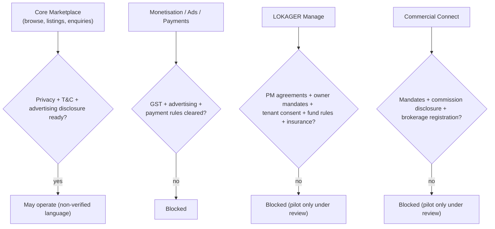

# 18 — Legal & Compliance Dependency Register

> Plain language: The legal and regulatory checkpoints LOKAGER must clear. This is a **register of dependencies**, not legal advice. It records that certain features — especially LOKAGER Manage and Commercial Connect — **cannot launch commercially until qualified legal/operational review is complete.** LOKAGER's trust-first brand depends on getting this right.

---

## 18.1 Hard rule: no unsupported trust claims

- The word **"verified"** (and "guaranteed", "certified") must not appear against listings, owners, brokers, developers or vendors until a **real, legally-approved verification process** exists and is functioning.
- No third-party brand/developer/bank logos without **written permission**.
- Sponsored/advertising content must be **clearly disclosed** as advertisement, never disguised as organic.

---

## 18.2 Compliance register

| # | Area | Dependency | Applies to | Blocking gate | Status |
|---|------|-----------|-----------|---------------|--------|
| 1 | Corporate | Company object clauses cover marketplace + management + commercial | All commercial ops | Before commercial launch | Founder/legal |
| 2 | Tax | GST registration + invoicing rules | Any paid service/ads | Before monetisation (Phase 5) | Pending |
| 3 | RERA | State-wise RERA registration/applicability for brokerage/agent activity | Listings, brokerage, projects | Before brokerage revenue | Pending (state-by-state) |
| 4 | Brokerage | Brokerage/commission disclosure requirements | Marketplace, Commercial | Before commission revenue | Pending |
| 5 | Owner mandates | Legally valid owner authorisation templates | Manage, Commercial | Before Phase 6/7 | Pending |
| 6 | Property-management agreements | PM agreement terms, liability, scope | Manage | Before Phase 6 | Pending |
| 7 | Tenant consent | Consent for data + management actions | Manage | Before Phase 6 | Pending |
| 8 | Vendor agreements | Vendor terms, liability, quality, payment | Manage | Before Phase 6 | Pending |
| 9 | Data privacy | Privacy policy, consent, retention, erasure (India DPDP) | All personal data | Before public accounts | Pending |
| 10 | Payment/rent handling | Whether LOKAGER may hold/route funds; aggregator/escrow rules | Manage, monetisation | Before any fund handling | Pending (recommend avoid initially) |
| 11 | Liability & insurance | Professional indemnity, property/management liability | Manage, Commercial | Before Phase 6/7 | Pending |
| 12 | Cancellation & dispute | Refund, cancellation, dispute-resolution terms | Paid services, Manage | Before monetisation | Pending |
| 13 | Advertising standards | Truthful advertising, disclosure, ASCI norms | Ads | Before Phase 5 | Pending |
| 14 | Identity/KYC | Lawful basis + process for any KYC/verification | Verification features | Before "verified" claims | Pending |
| 15 | Terms & Conditions | Platform T&C, acceptable use, provider terms | All users | Before public accounts | Pending |

---

## 18.3 Launch gates by vertical

**Explanation:** Each revenue/regulated capability sits behind a legal gate. The core marketplace can operate earliest (with careful, non-over-claiming language); Manage, Commercial and payments are gated behind their reviews.

---

## 18.4 Data-privacy specifics (India DPDP-aware)

| Requirement | Plan |
|-------------|------|
| Lawful basis + consent | Explicit, purpose-specific consent records (doc 03/14) |
| Data minimisation | Collect only necessary data |
| Retention | Defined per data category (founder/legal) |
| Erasure/rectification | Privacy-request workflow (audited) |
| Breach handling | Incident response + notification process |
| Data residency | India region recommended (doc 21) |
| Children/sensitive data | Avoid collecting; flag if unavoidable |

---

## 18.5 Founder/legal actions required
1. Engage qualified legal counsel for RERA (state-wise), brokerage, GST, DPDP, and agreements.
2. Decide fund-handling posture (recommend: no fund holding initially).
3. Approve verification definition + process before any "verified" language.
4. Approve privacy policy, T&C, provider terms before public accounts.

> This register must be reviewed and signed off by qualified legal counsel. It is a planning aid, **not** legal advice, and does not itself authorise any launch.
