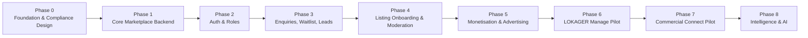
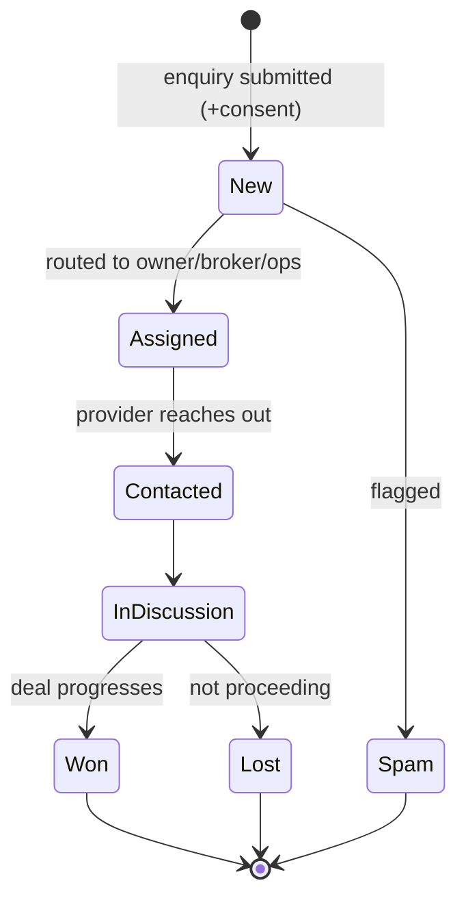
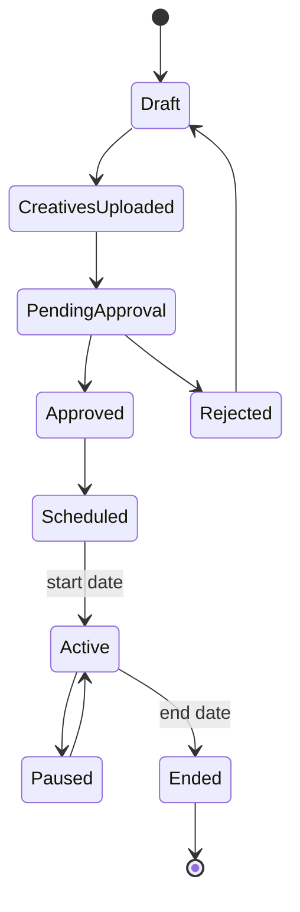

# 19 — Phased Implementation Roadmap (Phases 0–8)

> Plain language: The order in which LOKAGER Module 2 gets built, using the founder-approved priority. Value and low-risk work come first; regulated/expensive work (payments, Manage, Commercial, AI) comes later behind gates. **This is the sequence only — no implementation begins without founder approval.** Each phase is specified across 12 points: Scope · Dependencies · Data models · APIs · Admin tools · Security controls · Legal gates · Operational requirements · Acceptance criteria · Founder approvals · Complexity · Conditions to proceed.

---

## 19.0 Phase overview

**MVP tiering:** Phases 0–3 = **Required for MVP**. Phase 4–5 = **Required before commercial launch**. Phases 6–8 = **Future scale / new verticals**.

---

## PHASE 0 — Foundation & Compliance Design

| # | Point | Detail |
|---|-------|--------|
| 1 | Scope | Final architecture, PostgreSQL schema design, PROPERTY≠LISTING lifecycle, security architecture, audit-log strategy, media-storage design, legal/compliance register, dev/staging/prod environment plan |
| 2 | Dependencies | Founder approval of database (doc 07) and this roadmap |
| 3 | Data models | Schema definitions for core entities (doc 03), audit tables (doc 14) — design only |
| 4 | APIs | API contracts drafted (doc 08) — no implementation |
| 5 | Admin tools | Admin/ops console requirements defined |
| 6 | Security controls | Threat model, RBAC design, secrets strategy, TLS/encryption plan (doc 13) |
| 7 | Legal gates | Privacy policy, T&C, advertising-disclosure drafts initiated (doc 18) |
| 8 | Operational | Environment provisioning plan, CI/CD plan, monitoring plan |
| 9 | Acceptance criteria | Approved architecture + schema + security + DR + audit design documents |
| 10 | Founder approvals | Database choice, cloud/region, environments, data-residency |
| 11 | Complexity | Medium (design-heavy) |
| 12 | Conditions to proceed | All Phase 0 design docs approved; environments planned |

---

## PHASE 1 — Core Marketplace Backend

| # | Point | Detail |
|---|-------|--------|
| 1 | Scope | Property records, listing records, property/listing media, localities, amenities, search & category filters, property-detail APIs, listing status & freshness, advertisement campaign schema, admin moderation foundation |
| 2 | Dependencies | Phase 0 approved; DB + object storage provisioned |
| 3 | Data models | PROPERTY, LISTING, MEDIA, LOCALITY, AMENITY, PROPERTY_HISTORY, ADVERTISEMENT_CAMPAIGN, AD_CREATIVE (doc 03) |
| 4 | APIs | `GET /properties`, `/properties/{slug}`, `/listings`, `/localities`, `/projects`, `/ads/active`, `/config/filters`; admin CRUD (doc 08) |
| 5 | Admin tools | Basic admin to create/edit properties/listings/localities/ads; moderation queue skeleton |
| 6 | Security controls | Public read access; admin authZ; input validation; rate limits on public reads |
| 7 | Legal gates | Advertising disclosure live; no "verified" language |
| 8 | Operational | Seed real localities; migrate Module 1 demo content into structured records; connect frozen frontend via API mapping (doc 09) behind feature flag |
| 9 | Acceptance criteria | Module 1 renders from live API in staging with identical UX; filters work server-side; ad campaign served from API |
| 10 | Founder approvals | Go-live of API-backed homepage; content seeding approach |
| 11 | Complexity | Medium-high |
| 12 | Conditions to proceed | Frontend fully functional on API in staging; backups + audit active |

---

## PHASE 2 — Authentication & Role Management

| # | Point | Detail |
|---|-------|--------|
| 1 | Scope | Mobile/email authentication, user & organisation profiles, owners/seekers/brokers/developers/vendors, employees/admins, RBAC, account-linked saved properties & comparisons, session/account security |
| 2 | Dependencies | Phase 1; Redis; OTP/email providers chosen |
| 3 | Data models | USER, ORGANISATION, ROLE, USER_ROLE, ORG_MEMBER, CONTACT_IDENTITY, SAVED_PROPERTY, COMPARE_SELECTION (docs 05, 06) |
| 4 | APIs | `/auth/*`, `/me`, `/me/saved-properties`, `/me/compare`, `/organisations` (doc 08) |
| 5 | Admin tools | User/role management, org onboarding review, session/audit views |
| 6 | Security controls | OTP rate limits, token/session management, staff 2FA, RBAC enforcement, audit of auth events (docs 10, 13) |
| 7 | Legal gates | Privacy policy + T&C accepted at signup; consent records |
| 8 | Operational | Support process for account recovery |
| 9 | Acceptance criteria | Users log in via OTP; device saves migrate on login; RBAC enforced; staff protected with 2FA |
| 10 | Founder approvals | Auth method(s), social login on/off, provider-onboarding rules, identity-verification policy |
| 11 | Complexity | High (security-critical) |
| 12 | Conditions to proceed | Security review of auth passed; audit coverage verified |

> **Auth is an integration:** implemented via approved integration playbook (JWT custom auth or Emergent Google auth), never hand-rolled.

---

## PHASE 3 — Enquiries, Waitlist & Lead Management

**Enquiry / lead lifecycle:**

| # | Point | Detail |
|---|-------|--------|
| 1 | Scope | Early-access waitlist, express-interest & property enquiries, lead assignment/status, consent records, notifications, Email My Shortlist, spam/abuse protection, basic CRM/admin lead dashboard |
| 2 | Dependencies | Phase 2; transactional email provider; background jobs/queue |
| 3 | Data models | ENQUIRY/LEAD, WAITLIST_ENTRY, CONSENT_RECORD, SHARED_SHORTLIST(+items), NOTIFICATION (docs 03, 08) |
| 4 | APIs | `/enquiries`, `/waitlist`, `/shortlists`, `/shortlists/{token}/email`, `/consents`, `/admin/leads` (doc 08) |
| 5 | Admin tools | Lead dashboard: view, assign, status, notes; waitlist export; consent audit |
| 6 | Security controls | Rate limiting, spam/abuse detection, no PII in share URLs, contact masking option, consent enforcement |
| 7 | Legal gates | Email consent + privacy notice; no default marketing subscription; unsubscribe handling; advertising rules |
| 8 | Operational | Lead-handling SLA + team process |
| 9 | Acceptance criteria | Enquiry reaches assigned handler; waitlist captured; Email My Shortlist works with consent + expiry + rate limit; no recipient email exposed publicly |
| 10 | Founder approvals | Contact masking policy, lead-distribution rules, email provider |
| 11 | Complexity | Medium-high |
| 12 | Conditions to proceed | Consent + privacy verified; spam controls effective; leads reliably reaching handlers |

### Email My Shortlist — requirements
Explicit email consent · verified-email workflow where appropriate · transactional email only · no auto marketing subscription · privacy notice · rate limiting · abuse prevention · expiring/revocable share references · lead attribution without exposing recipient data · unsubscribe for marketing. **No email sending during planning.**

---

## PHASE 4 — Listing Onboarding & Moderation

| # | Point | Detail |
|---|-------|--------|
| 1 | Scope | Owner listing submission, broker/developer onboarding, media uploads, draft/review/publish workflow, listing editing/expiry, duplicate-property detection, listing-quality checks, admin approval, provider dashboards |
| 2 | Dependencies | Phases 1–2; media pipeline (doc 11) |
| 3 | Data models | Listing workflow states (doc 04), org onboarding, media moderation, duplicate flags |
| 4 | APIs | `/provider/listings/*`, `/media/uploads`, `/admin/listings/{id}/approve|reject`, `/admin/duplicates`, `/provider/orgs/onboard` (doc 08) |
| 5 | Admin tools | Moderation queue, quality checklist, duplicate review, provider approval, provider dashboards |
| 6 | Security controls | Private drafts, media scanning, scoped provider access, audit of moderation |
| 7 | Legal gates | Provider terms; **no "verified" language** until verification process approved (doc 18) |
| 8 | Operational | Moderation team + SLA; quality guidelines |
| 9 | Acceptance criteria | Provider submits → Ops reviews → publish; duplicates linked to one property; expiry works; rejected media never public |
| 10 | Founder approvals | Quality/moderation policy, expiry windows, duplicate-merge policy |
| 11 | Complexity | High |
| 12 | Conditions to proceed | Moderation throughput adequate; duplicate handling reliable; audit complete |

---

## PHASE 5 — Monetisation & Advertising

**Advertisement campaign lifecycle:**

| # | Point | Detail |
|---|-------|--------|
| 1 | Scope | Ad campaign management, desktop/mobile creative uploads, dates & targeting, advertiser approvals, sponsored disclosure, campaign reporting, subscription/package architecture, payment architecture, invoicing, GST dependencies |
| 2 | Dependencies | Phases 1–4; payment gateway (deferred), GST setup |
| 3 | Data models | CAMPAIGN, AD_CREATIVE, SUBSCRIPTION, INVOICE, PAYMENT (design), TARGETING |
| 4 | APIs | `/admin/campaigns/*`, `/billing/*`, `/payments/intent` (design; **not activated**) (doc 08) |
| 5 | Admin tools | Campaign console, advertiser approvals, reporting dashboards, invoice management |
| 6 | Security controls | PCI-conscious (no card storage; gateway tokens), audit of billing, disclosure enforcement |
| 7 | Legal gates | GST invoicing, advertising standards/disclosure, payment permissions (doc 18) — **payments not activated until cleared** |
| 8 | Operational | Advertiser onboarding, finance process |
| 9 | Acceptance criteria | Campaign lifecycle works; creatives served with disclosure; reporting accurate; billing design validated (no live payments) |
| 10 | Founder approvals | Pricing/packages, payment gateway, GST process, fund-handling |
| 11 | Complexity | High (financial + legal) |
| 12 | Conditions to proceed | Legal/tax/payment sign-off before activating live payments |

---

## PHASE 6 — LOKAGER Manage Pilot

*(Full architecture: doc 16.)*

| # | Point | Detail |
|---|-------|--------|
| 1 | Scope | Mandate, owner authorisation, PM assignment, tenant/lease, move-in/out reports, inventory, inspections, maintenance tickets, vendor quotes, owner approvals, work orders, before/after evidence, expenses, monthly owner reports, repair-approval limits, deposit assessment, escalation history |
| 2 | Dependencies | Phases 0–4 (+5 if fund handling); vetted vendors + managers |
| 3 | Data models | doc 16.3 |
| 4 | APIs | `/manage/*` (doc 08) |
| 5 | Admin tools | Manager assignment, ticket oversight, report generation, escalation handling |
| 6 | Security controls | Private evidence, strict scoping, owner-approval gates, full audit |
| 7 | Legal gates | PM agreements, owner mandates, tenant consent, vendor agreements, insurance, fund-handling permissions (doc 18) |
| 8 | Operational | Controlled Bengaluru/Mysuru pilot; vendor/manager network; SLAs |
| 9 | Acceptance criteria | Owner grants mandate, views inspections, approves repairs within/above limit, receives monthly report; evidence + audit complete |
| 10 | Founder approvals | Repair-approval limit, fund-handling, pilot city, fee model, insurance |
| 11 | Complexity | Very high (operational + financial + legal) |
| 12 | Conditions to proceed | Legal sign-off + successful controlled pilot before wider rollout |

---

## PHASE 7 — LOKAGER Commercial Connect Pilot

*(Full architecture: doc 17.)*

| # | Point | Detail |
|---|-------|--------|
| 1 | Scope | Commercial-owner mandates, commercial inventory, corporate/brand reps, space requirements, preferred city/micro-market, area & budget/rent range, matching, shortlisting, site visits, negotiation stages, proposals, lease coordination, commission disclosure, RM dashboard |
| 2 | Dependencies | Phases 0–4; org accounts; RM staffing |
| 3 | Data models | doc 17.3 |
| 4 | APIs | `/commercial/*` (doc 08) |
| 5 | Admin tools | RM dashboard, mandate management, match board, pipeline stages, commission tracking |
| 6 | Security controls | Confidential requirements, scoped RM access, audit |
| 7 | Legal gates | Commercial mandates, commission disclosure, brokerage registration, occupier agreements (doc 18) |
| 8 | Operational | Relationship managers; curated inventory; confidentiality handling |
| 9 | Acceptance criteria | Mandate + requirement captured; matches, site visits, negotiation, proposal with disclosed commission tracked; confidentiality upheld |
| 10 | Founder approvals | Commission model, confidentiality policy, launch cities, RM staffing |
| 11 | Complexity | Very high |
| 12 | Conditions to proceed | Legal sign-off; successful pilot matches; **no third-party logos without written permission** |

---

## PHASE 8 — Property Intelligence & AI

| # | Point | Detail |
|---|-------|--------|
| 1 | Scope | NL property search, comparison summaries, listing-quality assistance, duplicate/suspicious-listing signals, locality summaries, buyer-property matching, commercial requirement matching, lead prioritisation, maintenance-ticket classification, document extraction (human review), price insights on reliable data |
| 2 | Dependencies | Sufficient reliable, structured, legally-usable data from earlier phases |
| 3 | Data models | Feature stores/derived signals on top of core data |
| 4 | APIs | `/ai/*` — all **advisory** (doc 08) |
| 5 | Admin tools | Human-review queues, override controls, quality monitoring |
| 6 | Security controls | Data governance, PII controls, prompt/output safety, audit of AI-assisted decisions |
| 7 | Legal gates | AI must **not** independently make final legal, lending, valuation, verification, moderation or financial decisions |
| 8 | Operational | Human-in-the-loop review; model monitoring |
| 9 | Acceptance criteria | AI features assist humans measurably; no autonomous high-stakes decisions; outputs auditable |
| 10 | Founder approvals | AI provider/model strategy, cost budget, human-review policy |
| 11 | Complexity | High (data + governance) |
| 12 | Conditions to proceed | Reliable data + governance in place; per-feature founder approval |

> **AI guardrail:** every AI capability is advisory and human-supervised. No AI decision is final on legal, lending, valuation, verification, moderation or money.

---

## 19.1 Sequencing principles
- Deliver visible value early (Phases 1–3) at low legal risk.
- Gate regulated/expensive capability (Phases 5–8) behind explicit reviews.
- Do not begin any phase's implementation without founder approval of that phase.
- Manage & Commercial start as **controlled pilots**, not wide launches.
